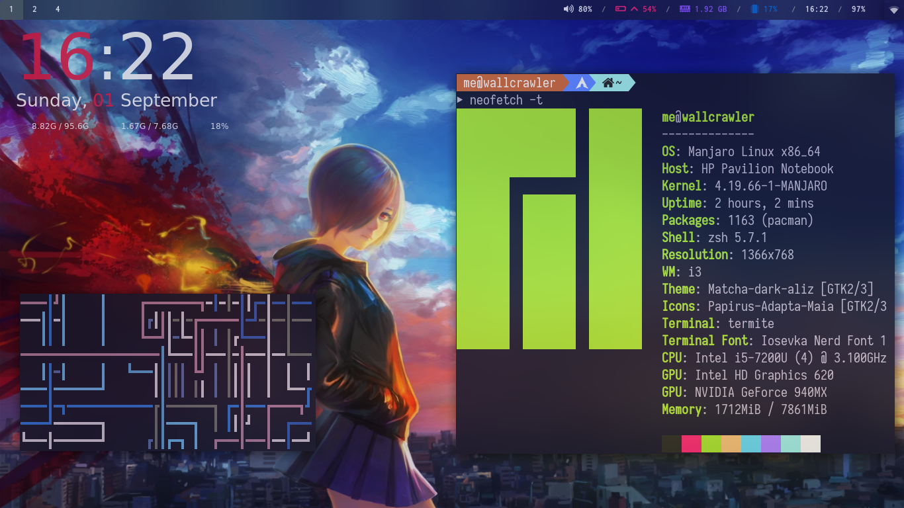
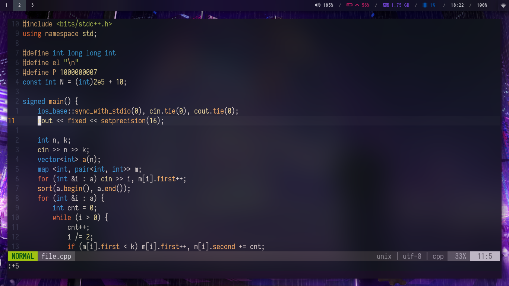
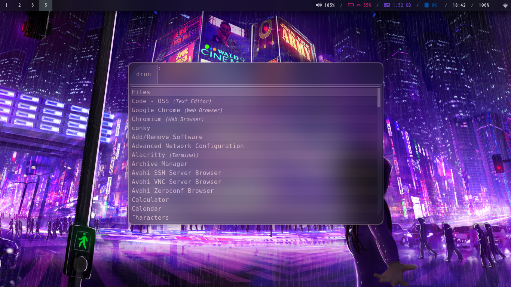
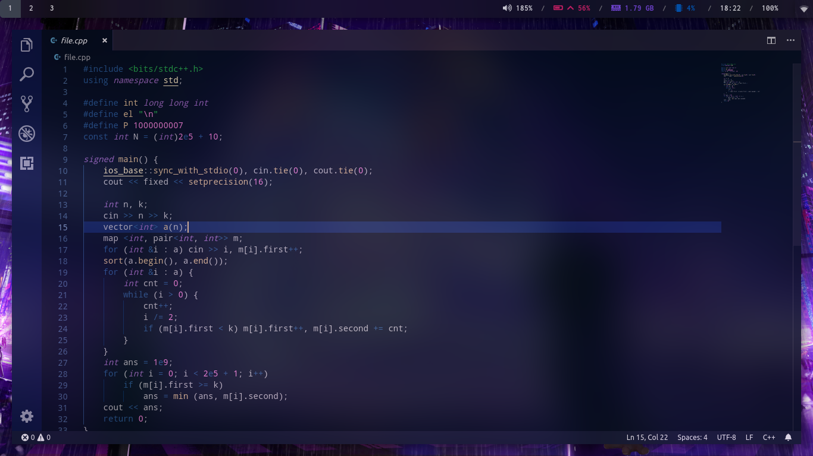

# i3 Config for Kawase Blur Using Compton Tryone

Just copy the configurations (preferably one by one for more control over customization process)
and you are done.

# Install

Install the following application in your system :

* nm-applet
* i3-gaps
* compton-tryone-git
* polybar 
* rofi 
* Iosevka Nerd Font
* ttf-font-awesome 
* termite 
* conky-lua 
* wal-git 
* xorg-xinput 
* xorg-xbacklight 
* pulseaudio 
* scrot
* gnome-screenshot 
* lxappearance
..................................................

# Conky Widget Used
* https://github.com/addy-dclxvi/conky-theme-collections/tree/master/syclo

# Screenshots
### Neofetch

### VIM

### Polybar

### Rofi

### VS-Code

